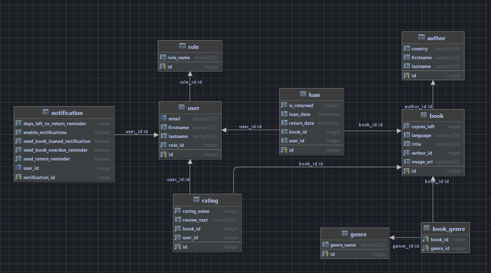

# Library Management System

The Library Management System is a Java application built using Spring Boot for the backend, SQLite as the relational database, and JavaFX for the frontend. The application follows the MVP (Model-View-Presenter) design pattern to ensure a clear separation of concerns.

## Database schema

## Features

- **Book Management:** Add, edit, and delete books from the library.
- **User Management:** Manage library members and their information.
- **Borrowing System:** Track borrowed and returned books.
- **Rating System:** Rate books after borrowing them from the library.
- **Search and Filters:** Find books and users with search and filter options.
- **Notifications:** Users get notifications about their new loans and whenever the return date is near. To avoid setting up SMTP server I used simple mail tracker.
